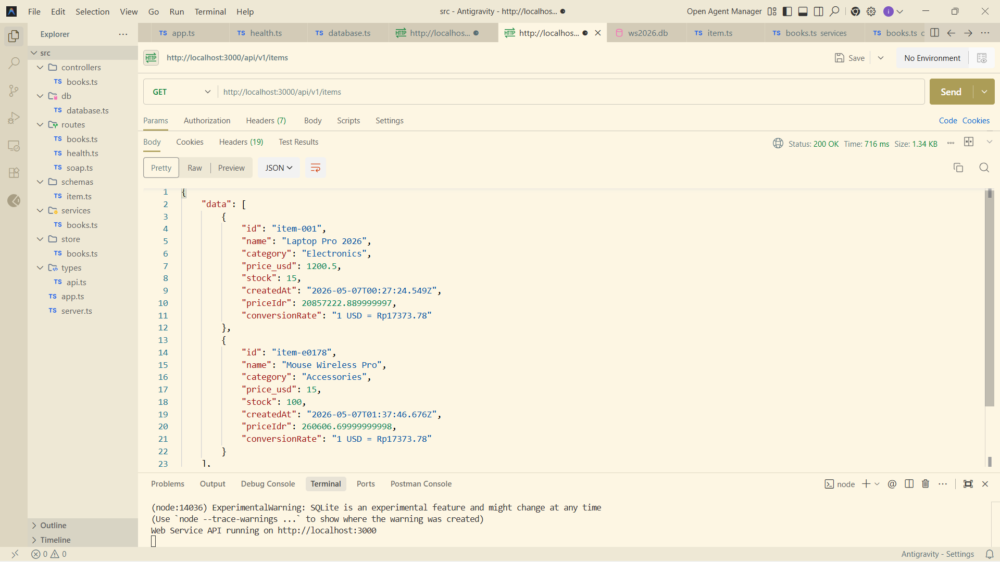
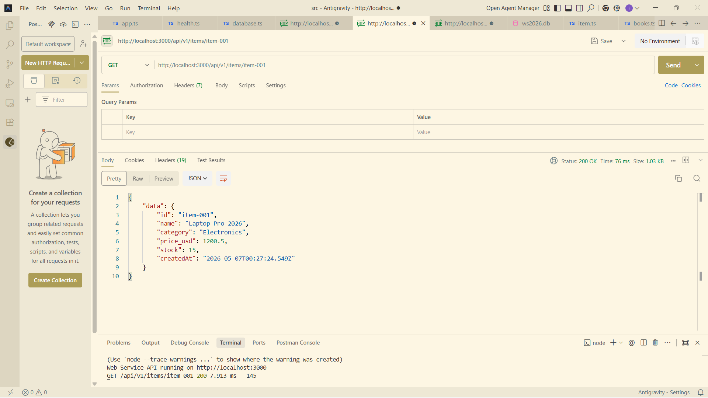
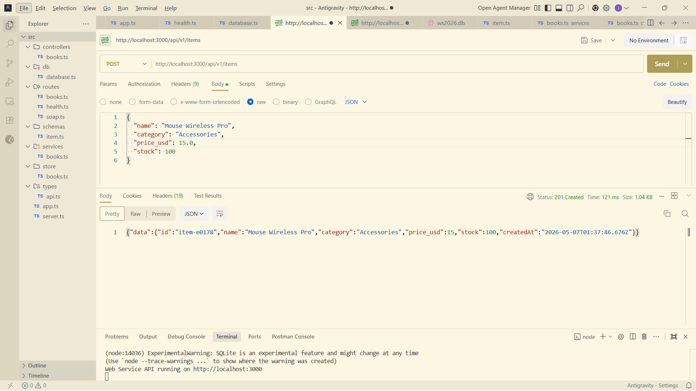
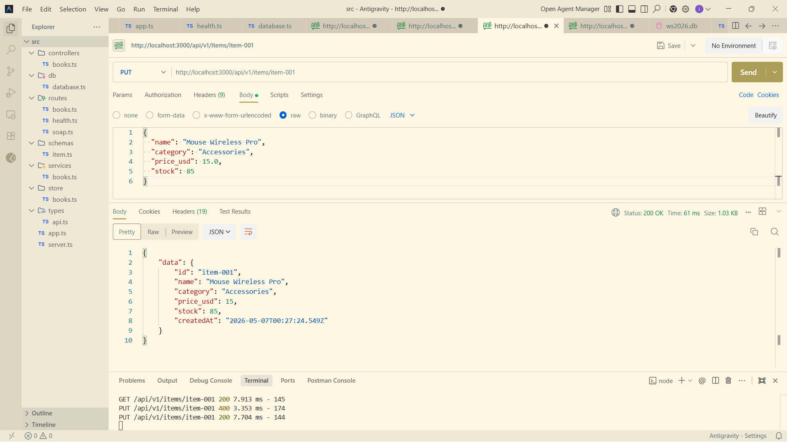
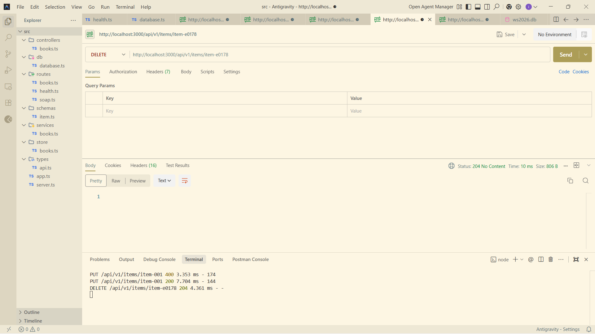
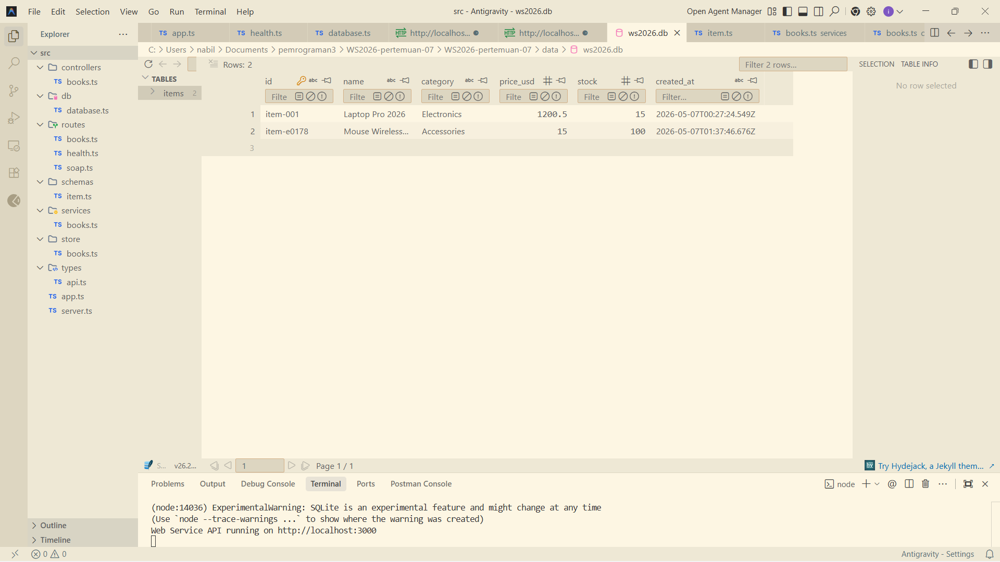

# Currency Integrated Inventory API

Web Service berbasis REST yang mengintegrasikan manajemen inventaris dengan konversi mata uang real-time menggunakan API eksternal.

## Fitur Utama
- **Full CRUD Inventaris**: Tambah, lihat, update, dan hapus data barang.
- **Database Persistence**: Menggunakan SQLite (file-based) sehingga data tetap tersimpan meskipun server dimatikan.
- **Real-time Exchange Rate**: Konversi harga otomatis dari USD ke IDR menggunakan integrasi API publik.
- **Data Validation**: Validasi input menggunakan library Zod.
- **Modern Tech Stack**: Dibangun menggunakan TypeScript untuk meningkatkan type-safety.

## Tech Stack
- **Backend**: Node.js, Express.js, TypeScript
- **Database**: SQLite (`node:sqlite`)
- **Validation**: Zod
- **Development Tool**: TSX untuk fast-reloading

## Cara Menjalankan Project

### 1. Persiapan & Instalasi
Clone repository ini ke komputer kamu, lalu buka terminal di folder project:

```bash
npm install
```

### 2. Menjalankan Server
Gunakan perintah berikut untuk menjalankan server dalam mode development:

```bash
npm run dev
```

Server akan berjalan di:

```txt
http://localhost:3000
```

---

## Dokumentasi API (Endpoints)

| Method | Endpoint | Keterangan |
| :--- | :--- | :--- |
| **GET** | `/api/v1/items` | Melihat semua daftar barang beserta harga IDR |
| **GET** | `/api/v1/items/:id` | Melihat detail barang berdasarkan ID |
| **POST** | `/api/v1/items` | Menambahkan barang baru ke database |
| **PUT** | `/api/v1/items/:id` | Memperbarui data barang |
| **DELETE** | `/api/v1/items/:id` | Menghapus barang dari database |

### Contoh Body untuk POST/PUT (JSON)

```json
{
  "name": "Mechanical Keyboard Pro",
  "category": "Accessories",
  "price_usd": 45.0,
  "stock": 20
}
```

---

## Alat Pendukung (Recommended Tools)

### 1. Testing API (Postman / Thunder Client)

Karena project ini tidak menggunakan UI web, gunakan **Postman** (saya menggunakan postman) atau ekstensi **Thunder Client** di VS Code untuk mencoba endpoint API.

- Pilih method (GET/POST/PUT/DELETE)
- Masukkan URL endpoint
- Untuk POST/PUT, pastikan tab **Body** diset ke format **JSON**

> Jika menggunakan Postman Web, pastikan sudah menginstal *Postman Desktop Agent*.

### 2. SQLite Viewer (Melihat Database)

Untuk memastikan data benar-benar tersimpan di file database `data/ws2026.db`:

- **VS Code Extension**  
  Install ekstensi **SQLite Viewer** di VS Code Marketplace. Setelah itu klik file `.db` di sidebar untuk melihat isi database seperti tabel spreadsheet.

- **Web Version**  
  Jika tidak ingin menginstal ekstensi, buka `sqliteviewer.app` lalu drag-and-drop file `ws2026.db` untuk melihat isi database secara langsung.

---

## Hasil Pengujian API

Berikut adalah beberapa hasil pengujian endpoint menggunakan Postman untuk memastikan seluruh fitur API berjalan dengan baik.

### 1. GET - Melihat Semua Data Barang
Endpoint:
```http
GET /api/v1/items
```



---

### 2. GET - Melihat Detail Barang Berdasarkan ID
Endpoint:
```http
GET /api/v1/items/:id
```



---

### 3. POST - Menambahkan Barang Baru
Endpoint:
```http
POST /api/v1/items
```

Contoh Body JSON:
```json
{
  "name": "Mouse Wireless Pro",
  "category": "Accessories",
  "price_usd": 15.0,
  "stock": 100
}
```



---

### 4. PUT - Memperbarui Data Barang
Endpoint:
```http
PUT /api/v1/items/:id
```



---

### 5. DELETE - Menghapus Data Barang
Endpoint:
```http
DELETE /api/v1/items/:id
```



---

### 6. Database SQLite
Data inventaris berhasil tersimpan secara permanen pada database SQLite.



## Catatan Progress

- REST API berhasil dibuat menggunakan Express.js dan TypeScript
- Seluruh fitur CRUD telah diuji menggunakan Postman
- Database SQLite berhasil terhubung dan dapat menyimpan data secara permanen
- Integrasi API eksternal berhasil diterapkan pada file `books.ts` di folder `services`
- Sistem sudah dapat melakukan konversi harga secara otomatis menggunakan data API luar
- Project saat ini masih berbasis backend API dan belum memiliki tampilan UI/frontend
